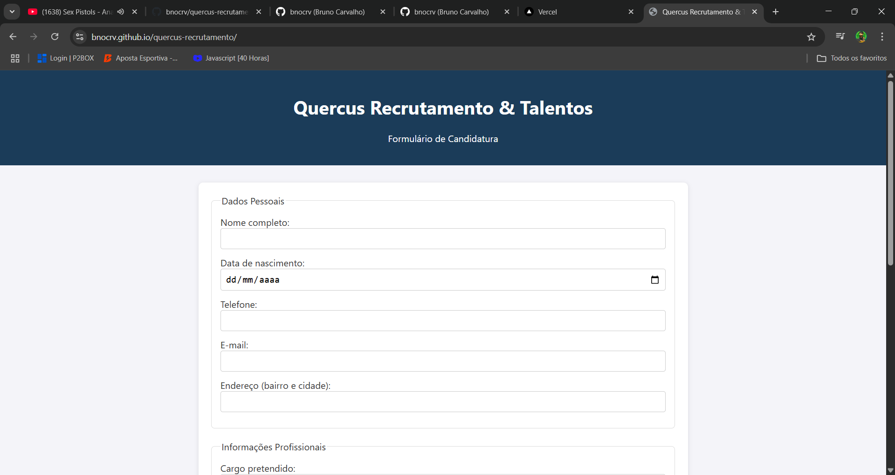

# 📝 Quercus Recrutamento

**Quercus Recrutamento** é uma aplicação web simples para simulação de candidatura a vagas de emprego. Criada com **HTML**, **CSS** e **JavaScript**, e integrada com o **Firebase**, a aplicação coleta e armazena dados do formulário em tempo real.

Esse projeto marcou meus primeiros testes com **backend como serviço** (BaaS), visando entender melhor o fluxo de envio, validação e persistência de dados em um banco em nuvem.

[🔗 Acesse o projeto](https://bnocrv.github.io/quercus-recrutamento/)

---

---

# 🧩 Funcionalidades principais

- Formulário com campos típicos de candidatura:
  - Nome completo, e-mail, telefone
  - Área de interesse e disponibilidade
  - Campo de mensagem personalizada
- Validação básica de campos obrigatórios
- Armazenamento de dados via **Firebase Realtime Database**
- Confirmação visual após envio
- Interface simples, clara e responsiva

---

# 📷 Screenshot

---

# 🧠 Conceitos e tecnologias aplicadas

- Estruturação com **HTML5 semântico**
- **CSS3** para layout simples e responsivo
- **JavaScript vanilla** para manipulação do formulário e controle de fluxo
- Integração com **Firebase** (Realtime Database)
- Primeiros testes com backend e persistência de dados remota
- Tratamento de eventos e feedback ao usuário

---

# 🧪 Melhorias futuras

- Validação de e-mail mais robusta
- Máscara de campo para telefone
- Upload de currículo (PDF)
- Tela administrativa para consultar inscrições recebidas
- Integração com autenticação Firebase para painel restrito
- Notificações ou confirmação por e-mail

---

# 👨‍💻 Sobre

Este projeto foi criado durante meus primeiros testes com integração de front-end com serviços de backend em nuvem. Fez parte dos meus estudos em **Análise e Desenvolvimento de Sistemas (ADS)** e foi uma ótima oportunidade para entender o fluxo completo de dados: do formulário até o banco de dados.

---

# 📫 Contato

- GitHub: [@bnocrv](https://github.com/bnocrv)  
- LinkedIn: [@bnocrv](https://linkedin.com/in/bnocrv)
